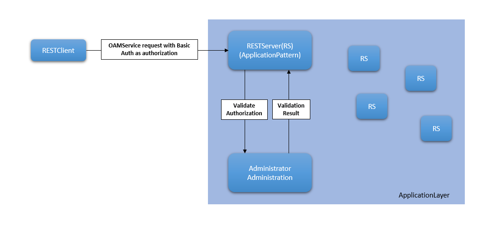

## Authorization
In all the approved applications of ApplicationPattern , 
* OAM services are authorized by using BasicAuth 
* Both the Individual and Basic services are authorized by using an operation-key

### OAM service :

 
* Every OAM service request is authorized by using BasicAuth. 
* Usually, an administrator shall access the OAM services by using a username and password. 
* When an application receives an OAM request , the BasicAuth will be validated with the help of one of the applications in Tiny Application Controller called “AdministratorAdministration”(AA). 
* This AA application exposes a service called “approve-oam-request”. All the approved applications in the ApplicationPattern shall access this request in AA to validate the incoming OAM requests. 
* Based on the validation results , OAM services can either processed further or rejected with 401 unauthorized response code.

### Basic and Individual services :

 

* In the CONFIGFile , for every exposed Individual and Basic services , there shall be an OperationServer. 
* Every OperationServer instance holds a configurable attribute named “operation-key”. Values of operation-keys will be modified periodically by another application called OperationKeyManagement for security reasons.
* The incoming Basic/Individual services will be validated against the “operation-key” mapped for the corresponding service request. 
