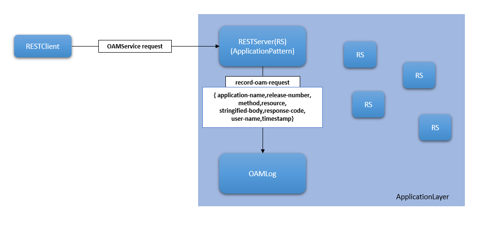

## Directing Logs and Traces

In all the approved applications of ApplicationPattern , 
* the OAM layer logs the OAM request information to a Tiny Application Controller called “OAMLog”(OL)
* Both the Individual and Basic services log the service request to a Tiny Application Controller called “ExecutionAndTraceLog”(EATL)

### OAM Request

 
After processing an OAM request , the following details will be logged into the OL application using the service “record-oam-request” , 
- application-name : Name of application addressed by OaM request
- release-number : Release number of application addressed by OaM request
- method : HTTP method of the request (for example GET, PUT etc.,)
- resource : 'Resource addressed'
- stringified-body : Body of the OaM request
- response-code : Response code on the OaM request
- user-name : Username extracted from Authorization header used to identify in basicAuth
- timestamp : Date and time when response was sent

The logged information shall be useful to track the configuration changes. 
OL provided the following services to track the configuration changes , 
* list-records
* list-records-of-application

### Basic and Individual Service Request

 
After processing a Basic/Individual service request , the following details will be logged into the EATL application using the service “record-service-request”.
- x-correlator:UUID for the service execution flow that allows to correlate requests and responses
- trace-indicator:Sequence of request numbers along the flow
- user:User identifier from the system starting the service call
- originator:ApplicationName on the client side
- application-name:ApplicationName on the server side
- application-release-number:ReleaseNumber on the server side
- operation-name:Name of operation consumed on the server side
- response-code:http response code of this request

The following parameters are optional and will be sent if the "detailed-logging-is-on" attribute of the OperationClient of "record-service-request" is true , 
- timestamp:Date and time when response was sent
- stringified-body:Body of the request
- stringified-response:Body of the response

Later ,the following services in EATL application can be used for debugging purpose 
- list-records, 
- list-records-of-flow , 
- list-records-of-unsuccessful

